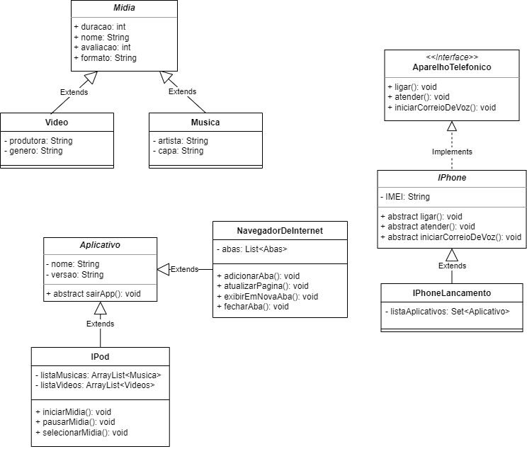

## Desafio de Projeto Bootcamp Suntander 2023
### 📌 Proposta
"Elaborar a diagramação UML e elaboração do código equivalente, seguindo as  seguintes referências:"
- Lançamento do Iphone (2007) -> [🎞 Video](https://www.youtube.com/watch?v=9ou608QQRq8)

- Representar os seguintes processo:

    - Reprodutor musical
    - Aparelho Telefônico
    - Navegador de Internet

### 📚 Pilares POO

| Abstração                                               | Encapsulamento                                         | Herança                                                                                                   | Polimorfismo                                                                                   |
|---------------------------------------------------------|--------------------------------------------------------|-----------------------------------------------------------------------------------------------------------|------------------------------------------------------------------------------------------------|
| Representação de somente recursos relevantes ao sistema | Esconde detalhes e complexibilidade das implementações | Relacionemento entre classes que permite que classes filhas herdem atributos relacionados as classes pais | Capacidade de execução distintas de um mesmo método por classes diferentes de maneira distinta |

### ⚙ Ferramentas utilizadas
 
Elaboração da UML: [draw.io](www.draw.io)

IDE: IntelliJ

Linguagem: Java

### 👍 Imagem UML (Resultado)

    
